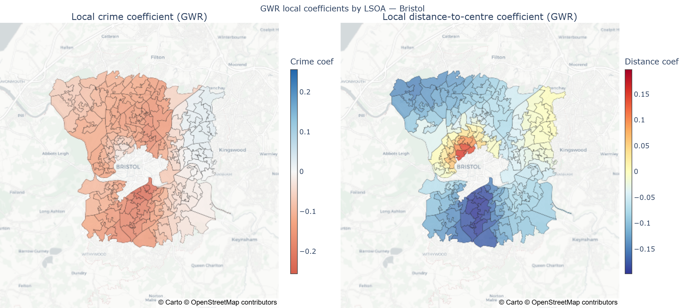
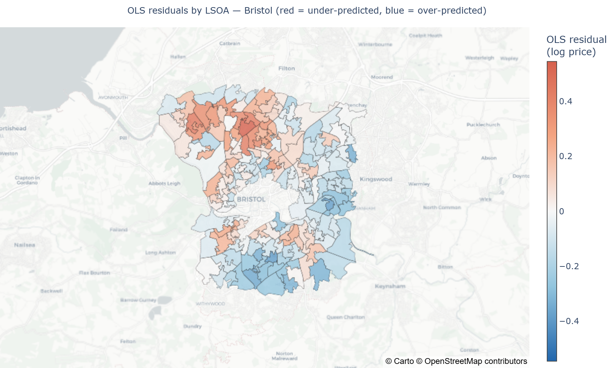
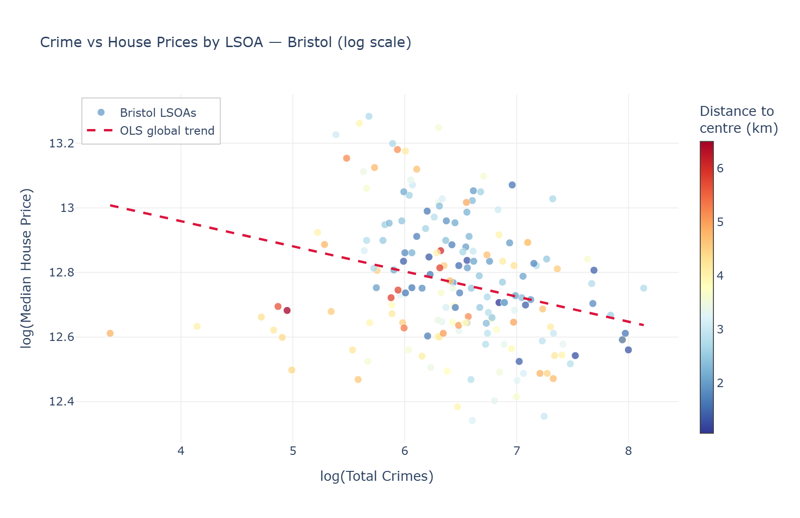

# Bristol Crime & House Prices — where crime actually moves prices, and where it doesn't

**Live dashboard:** https://bristol-crime-houseprices-gwr-ltekhgkvespsoc3hi7e4ar.streamlit.app

Standard regression says crime knocks about 7.5% off house prices across Bristol. That single number is misleading: it hides the fact that the true effect ranges from a 22.6% price penalty in some neighbourhoods to a slight positive association in others. This project uses Geographically Weighted Regression (GWR) to model the crime–price relationship separately for each of Bristol's 182 neighbourhoods (LSOAs), rather than forcing one national-style average onto a city where local context clearly dominates. The spatially-varying model explains 73.9% of price variation, against just 10.8% for the conventional global model — a result confirmed by a formal spatial autocorrelation test (Moran's I = 0.5408, p = 0.001).

## Key Findings

- **A single global model is the wrong tool for this question.** The standard regression (OLS) explains only 10.8% of house price variation (R² = 0.108); allowing the crime effect to vary by neighbourhood (GWR) lifts that to 73.9% (R² = 0.739) using the exact same five predictors.
- **The effect of crime on price varies from −22.6% to +2.6% depending on the area** — the GWR crime coefficient ranges from −0.256 to +0.025 across Bristol's 182 LSOAs, compared to a single flat −7.5% under the standard model.
- **76% of Bristol neighbourhoods show a real, negative crime-to-price effect**; the remaining 24% — mostly inner-city areas — have strong enough location advantages (schools, transport, proximity to the centre) to offset crime's usual price penalty.
- **Neighbouring areas have statistically similar pricing errors** (Moran's I = 0.5408, p = 0.001), which is the formal statistical justification for why a spatial model is necessary here rather than a one-size-fits-all regression.
- Built on **34,543 house transactions** and **159,666 recorded crimes** across Bristol, 2021–2025.

## Screenshots

**Local crime coefficient by LSOA — the result the global model hides.** Red areas are where crime carries a real price penalty; the pale and blue areas to the east are where it doesn't. A single OLS coefficient averages this entire map down to one number.



**OLS residuals.** Neighbouring areas have similar errors — the visual counterpart to Moran's I = 0.5408, and the reason a spatial model is warranted here.



**Crime against price across the 182 LSOAs.**



An interactive version of the scatter is at `outputs/figures/scatter_crime_price.html`, and the dashboard has the rest.

---

## Tech Stack

| Tool | Purpose |
|------|---------|
| pandas, numpy | Data cleaning and aggregation |
| geopandas, shapely, pyproj | Spatial joins, geometry, coordinate transforms |
| statsmodels, scikit-learn | OLS regression, VIF diagnostics |
| mgwr | Geographically Weighted Regression |
| esda, libpysal | Moran's I spatial autocorrelation test |
| matplotlib, seaborn | Static charts |
| plotly, kaleido | Interactive maps + static image export |
| streamlit | Interactive dashboard |

## Methodology

1. **Clean and filter** HM Land Registry (house prices) and Police.uk (crime) records to Bristol, removing price outliers via the 1.5×IQR rule.
2. **Aggregate to LSOA level** (182 neighbourhoods) — median price, sales volume, property mix, total crimes.
3. **Engineer features**: distance to city centre, school density, distance to nearest bus stop.
4. **Check multicollinearity (VIF)** — `prop_flats` and `prop_leasehold` were near-duplicates (VIF 12.7 and 12.9, and r = 0.96), so `prop_leasehold` was dropped; every remaining VIF is below 5.
5. **Fit a global OLS baseline**, then test its residuals for spatial autocorrelation with **Moran's I** — a significant positive result (I = 0.5408, p = 0.001) is the formal evidence that a single global coefficient is hiding real neighbourhood-level variation.
6. **Fit GWR** with an adaptive bisquare kernel (bandwidth selected automatically by minimising AICc, giving 57 neighbours) — this produces a separate crime coefficient for every LSOA instead of one number for the whole city.
7. **Compare models** on R², adjusted R² and AICc, then visualise where the local coefficients diverge from the global average.

GWR was chosen over a global model specifically *because* Moran's I confirmed the OLS residuals were spatially clustered — that test result is the evidence that justifies the more complex spatial model, rather than using it by default.

## Project Structure

```
bristol-crime-houseprices-gwr/
├── data/
│   ├── raw/                              # Cleaned transaction/incident-level snapshots (zipped)
│   │   ├── house_prices_bristol_clean.zip
│   │   └── crime_bristol_clean.zip
│   └── processed/                        # Final analysis-ready data (shipped, no download needed)
│       ├── regression_dataset.geojson    # 182 LSOAs, all model variables + GWR/OLS results
│       ├── summary_statistics.json       # Headline model metrics
│       └── full_boundaries.geojson       # All 268 Bristol-area LSOA boundaries
├── notebooks/
│   └── GWR_crime_price_project.ipynb     # Full analysis: cleaning → OLS → GWR → conclusions
├── outputs/
│   └── figures/                          # 9 saved charts (static PNGs + 1 interactive HTML)
├── src/
│   ├── data_loading.py                   # Load raw price/crime/geo data
│   ├── cleaning.py                       # Bristol filtering, outlier removal
│   ├── aggregation.py                    # Transaction-level → LSOA-level aggregation
│   ├── features.py                       # Distance/school/transport feature engineering
│   ├── modelling.py                      # OLS, GWR, Moran's I, model comparison
│   └── visualization.py                  # All 8 chart-producing functions
├── app.py                                # Interactive Streamlit dashboard
├── requirements.txt                      # Dashboard dependencies
├── requirements-notebook.txt             # Analysis pipeline dependencies
├── .gitignore
└── README.md
```

## How To Run

The dashboard runs on **Python 3.11+**. Reproducing the analysis notebook needs **Python 3.12+**, because the pinned `numpy` and `scipy` publish no wheels below that.

Dependencies are split in two, so deploying the dashboard doesn't drag in the heavy geospatial stack:

```bash
git clone https://github.com/layaung-linnlett/bristol-crime-houseprices-gwr.git
cd bristol-crime-houseprices-gwr

# Dashboard only (streamlit, plotly, pandas, numpy, pyproj)
pip install -r requirements.txt
streamlit run app.py

# Analysis notebook — needs geopandas, mgwr, esda, statsmodels and friends
pip install -r requirements-notebook.txt
jupyter notebook notebooks/GWR_crime_price_project.ipynb
```

The notebook runs immediately against the cleaned snapshot in `data/` — no download needed — and detects whether it's running in Colab or locally, picking the right paths either way. Rebuilding from the original raw government sources is also supported; see `data/README.md`.

## Limitations & Future Work

- **Cross-sectional, not causal.** This analysis shows association, not causation — crime and prices may both be responding to unmeasured factors like deprivation or housing tenure mix.
- **Crime is treated as one undifferentiated count.** Violent crime, burglary and anti-social behaviour are all weighted equally; disaggregating by crime type could reveal different spatial price effects for each.
- **GWR bandwidth choice affects local estimates.** The adaptive bisquare kernel and AICc-selected bandwidth (57 neighbours) are a defensible choice, but local coefficients are inherently less stable than a single global estimate — they should be read as a pattern, not a precise per-LSOA prediction.

## Contact

**La Yaung Linn Lett** — BSc Data Science and AI, University of the West of England, Bristol, 2026

[GitHub](https://github.com/layaung-linnlett) | [LinkedIn](https://www.linkedin.com/in/layaung-linnlett/)
